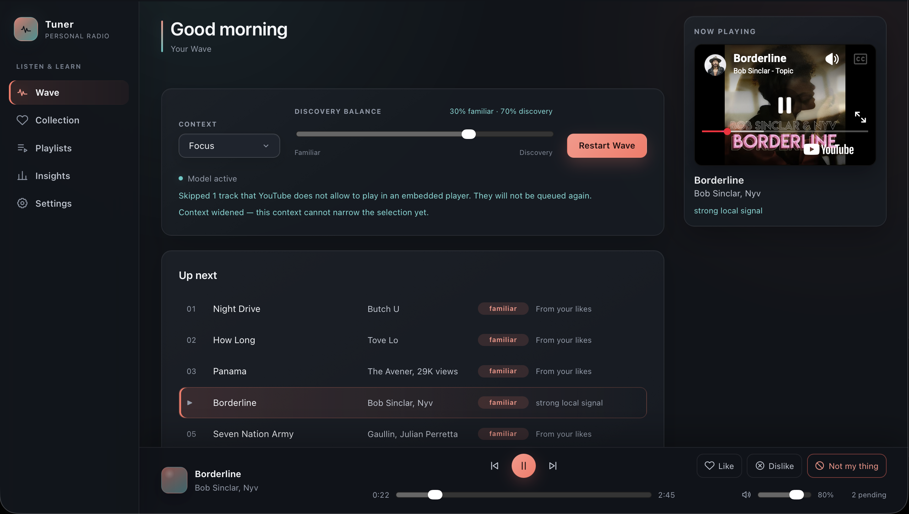

# YouTube Music Tuner

A local personal music player and recommender system on top of YouTube Music. The application must learn from likes, skips, full listens, repeats and other interaction, build a "wave" with a controllable temperature, and carefully publish several private playlists back to YouTube Music.



## Status

The documentation has been brought to revision 1.3, and phases 0–7 of the [roadmap](docs/12-roadmap.md) are implemented: backend, frontend, YouTube Music integration, a player with telemetry, the recommender, online learning, safe publishing, maintenance and selection quality. The application starts with a single command; a real end-to-end run on a live account (`REAL_YTM_TESTS=1`) has not been performed yet.

What already works:

- health/readiness, migrations, JSON logs with secret redaction;
- OAuth device flow via the CLI, sync of likes/playlists/history;
- own player on top of the YouTube IFrame with honest accounting of what was listened to;
- "Wave" with temperature, mood and explanations of the selection;
- LinUCB in shadow mode, activated after a clean baseline;
- creation and publication of three private Tuner playlists with backup and verify;
- daily backup, retention and external-call budgets.

## Decisions on record

- the application is single-user, local and non-commercial;
- running — as a single Docker Compose service at `http://127.0.0.1:43127`;
- own React interface, with playback through the visible YouTube IFrame Player;
- library and playlist integration through `ytmusicapi`, pinned to a verified version;
- telemetry is stored locally in SQLite and sent to the backend in batches;
- the main recommender is a local contextual bandit with explicit diversity rules;
- an external or local LLM is not needed for the main recommendation;
- the first 100 qualified listens are served by the rule-ranker; LinUCB learns in SHADOW from the 40th session and affects the queue only after the baseline and safety gates;
- publishing uses an adaptive playlist size of 25–60 and a crash-safe CREATING/UNVERIFIED manifest, and writes only to ACTIVE Tuner playlists;
- each subsequent publish is limited to 15 changed items, 15 mutating requests and a 24-hour window; PARTIAL completes without requiring new listens.

## Documentation

Navigation and the recommended reading order are in [docs/README.md](docs/README.md).

Key documents:

- [product requirements](docs/01-product-requirements.md);
- [system architecture](docs/02-system-architecture.md);
- [YouTube Music integration](docs/03-youtube-integration.md);
- [recommendation engine](docs/05-recommendation-engine.md);
- [operations in Docker](docs/09-operations-docker.md);
- [risks and privacy](docs/10-security-privacy-risks.md);
- [development plan](docs/12-roadmap.md).

## Running

```bash
docker compose up --build -d
curl --fail http://127.0.0.1:43127/health/ready
```

The interface is available only on the loopback address:

```text
http://127.0.0.1:43127
```

The port is changed through `APP_PORT` in `.env`; there is no need to rebuild the image.

### Connecting to YouTube Music

A self-made Google Cloud OAuth client has been tested and **does not work**: the device flow succeeds, but YouTube Music responds with `HTTP 400` to any request with such a token. The working way is browser authentication.

**The easiest way is the button in the interface:** open http://127.0.0.1:43127 → Settings → **Connect**. The panel will show three steps (open music.youtube.com, copy the request headers in DevTools, paste them) and verify them with a real request.

**With a single command in the terminal:**

```bash
./connect.sh
```

The script will open a browser window, wait for the login, collect the headers itself, import them and wipe the temporary file.

Both paths confirm success only after a real response from YouTube Music. Details and the fallback OAuth path: [docs/03](docs/03-youtube-integration.md).

Next, in Settings click "Sync now", then on the Playlists screen make a preview and create the three Tuner playlists.

### Maintenance

```bash
# A verified backup with a manifest and integrity check
docker compose exec tuner python -m app.cli backup

# Copy the backup from the named volume to the host (only this makes it external)
docker compose cp tuner:/data/backups/<stamp> ./backups/<stamp>

# Logs without follow
docker compose logs --tail=200 tuner

# Stop without deleting data
docker compose down
```

`docker compose down -v` will delete the volume together with the DB, OAuth and backup copies — do not use it as an ordinary command.

## Development

```bash
python3 -m venv .venv && .venv/bin/pip install -e "./backend[dev]"
cd backend && ../.venv/bin/python -m pytest -q          # 215 tests
../.venv/bin/ruff check . && ../.venv/bin/mypy app

cd frontend && npm install && npm run build && npx vitest run
```

Running locally without Docker:

```bash
cd backend && TUNER_DATA_DIR=../data ../.venv/bin/alembic upgrade head
TUNER_DATA_DIR=../data ../.venv/bin/python -m uvicorn app.main:app --host 127.0.0.1 --port 43127
cd frontend && npm run dev    # Vite on 43128 with /api proxying
```

## Structure

```text
backend/app/
  api/            HTTP routes, DTOs, guard middleware, error mapping
  domain/         catalogue types independent of ytmusicapi
  integrations/   ytmusicapi adapter, ledger, budgets, circuit breaker
  player/         session aggregation and the reward formula
  recommender/    features, rule-ranker, LinUCB, reranker, temperature
  publishing/     quality gates, diff planner, publication state machine
  jobs/           queue with leases, scheduler, sync/train/maintenance
  persistence/    SQLAlchemy models and repositories
frontend/src/
  player/         iframe adapter, listen tracker, telemetry outbox
  features/       wave, library, playlists, insights, settings
```

## Important limitation

`ytmusicapi` is an unofficial library that replicates the requests of the YouTube Music web client. For a personal tool the risk is accepted, but the adapter must be isolated, calls must be limited, and updating the dependency must pass contract smoke tests. Details: [ADR-001](docs/decisions/ADR-001-use-ytmusicapi.md).
