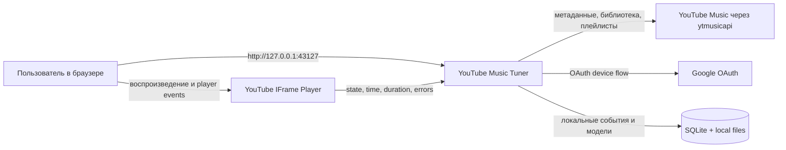
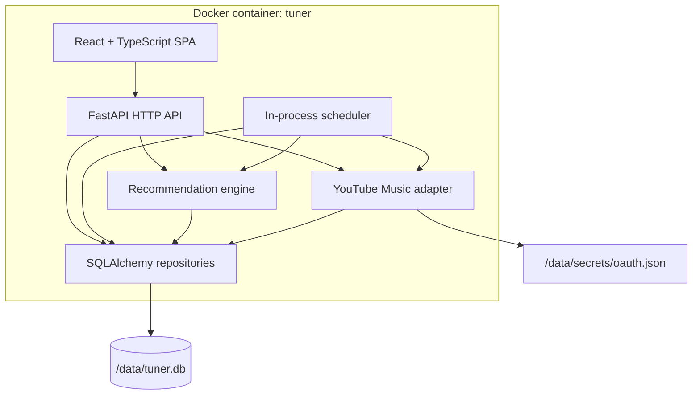
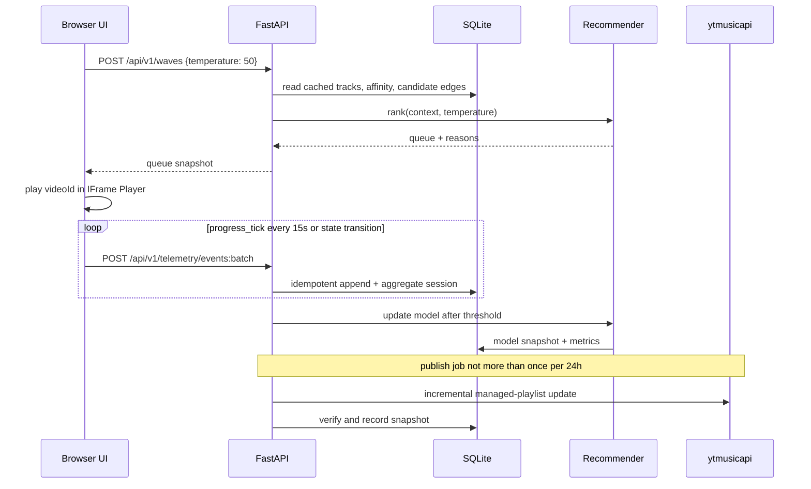

# Системная архитектура

## 1. Архитектурный стиль

Локальный модульный монолит с одним web-процессом и одной SQLite-базой. Frontend собирается отдельно в multi-stage Docker build, но в runtime раздаётся FastAPI из того же контейнера. Такое устройство снижает операционную сложность и исключает Redis, message broker и отдельный model server.

Внутри монолита сохраняются строгие границы: UI, playback telemetry, recommendation domain и YouTube adapter не должны знать детали друг друга через общие глобальные объекты.

## 2. Контекст



Воспроизведение выполняется браузером через официальный IFrame Player. Backend не получает и не проксирует аудиопоток.

## 3. Контейнерная схема



## 4. Выбранный стек

### Backend

- Python 3.13 в runtime-образе;
- FastAPI + Uvicorn, один worker;
- Pydantic для внешних DTO и настроек;
- SQLAlchemy 2 + Alembic;
- SQLite в WAL mode;
- `ytmusicapi==1.12.1` на старте реализации;
- NumPy для локального LinUCB/contextual-bandit расчёта;
- структурированные JSON-логи стандартного `logging`.

Точные версии всех runtime-зависимостей фиксируются lockfile. Обновление `ytmusicapi` — отдельная контролируемая операция.

### Frontend

- React + TypeScript + Vite;
- TanStack Query для server state;
- Zustand либо небольшой reducer-store для player/queue state;
- CSS variables + CSS Modules; без тяжёлой компонентной системы;
- YouTube IFrame Player API;
- Playwright для end-to-end тестов.

### Runtime

- multi-stage Dockerfile: Node build stage → Python runtime stage;
- Docker Compose для порта, named volume, health check и конфигурации;
- bind `127.0.0.1:${APP_PORT:-43127}:43127`;
- один named volume `tuner-data:/data`; runtime identity фиксирована как UID/GID `10001:10001`.

## 5. Backend-модули

Планируемая структура:

```text
backend/app/
  api/              HTTP routes, DTO, error mapping
  auth/             OAuth status and bootstrap CLI
  domain/           track, playlist, telemetry and recommendation models
  integrations/
    youtube_music/  ytmusicapi adapter and parsers
  player/           session aggregation and signal classification
  recommender/      features, candidate generation, ranking, reranking
  publishing/       managed-playlist planner and state machine
  jobs/             scheduler, leases, cooldowns, retries
  persistence/      SQLAlchemy models and repositories
  settings.py
  main.py
```

Правило зависимости: `api/jobs → application services → domain + repository interfaces`; реализация `ytmusicapi` не импортируется из domain/recommender.

## 6. Frontend-модули

```text
frontend/src/
  app/              routing and shell
  features/
    wave/
    library/
    playlists/
    insights/
    settings/
  player/           iframe adapter, queue, telemetry accumulator
  api/              generated/typed HTTP client
  ui/               reusable presentational components
  styles/            tokens and global layout
```

`player/iframeAdapter` — единственное место, знающее глобальный объект `YT.Player`. Остальной frontend работает с интерфейсом `PlayerPort`.

## 7. Основной поток данных



## 8. Scheduler и конкурентность

Отдельный job broker не нужен. Один Uvicorn worker запускает лёгкий scheduler в lifespan приложения. Периодическая проверка на due jobs читает таблицу `jobs`, а каждая работа захватывает lease с `locked_until`.

Это защищает от повторного выполнения после рестарта и оставляет возможность позднее вынести worker без изменения доменной логики. Даже при ошибочной конфигурации с двумя процессами уникальный idempotency key и lease не позволят одновременно публиковать один плейлист.

Типы работ:

- `library_sync`;
- `candidate_refresh`;
- `model_train`;
- `playlist_publish`;
- `retention_cleanup`;
- `database_backup`.

## 9. Состояние и кеширование

- Browser state: текущая очередь, позиция, UI-фильтры и durable IndexedDB outbox неподтверждённых событий.
- SQLite: источник истины для каталога, телеметрии, модели, jobs и publish manifest.
- YouTube Music: внешний источник библиотеки и целевое хранилище управляемых плейлистов, но не источник истины для локальной телеметрии.
- In-memory cache: допустим только как ускорение; после рестарта всё восстанавливается из SQLite.

## 10. Обработка отказов

| Отказ | Поведение |
| --- | --- |
| YouTube Music недоступен | UI продолжает работать на кешированных данных; job получает backoff. |
| OAuth истёк/отозван | write/sync jobs блокируются, UI показывает reconnect; локальное слушание кешированной очереди остаётся доступным, если iframe способен загрузить трек. |
| Сломался parser `ytmusicapi` | adapter возвращает typed integration error; сырой ответ не логируется целиком; последняя успешная библиотека сохраняется. |
| Контейнер перезапущен во время publish | state machine делает fresh read и verification: подтверждает COMPLETE, сохраняет PARTIAL с continuation на следующее 24-часовое окно либо помечает FAILED; WRITING слепо не повторяется. |
| Дублирован batch | unique `client_event_id` превращает повтор в no-op. |
| IFrame error | событие нейтрально для вкуса, трек временно помечается playback-unavailable и очередь идёт дальше. |
| Повреждение БД | запуск останавливается с явной ошибкой; автоматическое восстановление из backup без подтверждения не выполняется. |

## 11. Наблюдаемость

- `GET /health/live` — процесс отвечает;
- `GET /health/ready` — миграции применены, БД доступна;
- UI Settings показывает last successful sync/train/publish, количество pending events и открытый circuit breaker;
- логи содержат `request_id`, `job_id`, `operation`, `duration_ms`, `outcome`, но не трековые токены авторизации и не полные внешние payload;
- таблица `api_call_ledger` даёт локальный audit внешних операций.

## 12. Архитектурные ограничения

- Backend не должен получать прямой URL аудиопотока.
- UI не должен имитировать, скрывать или перекрывать обязательные элементы YouTube player.
- Рекомендация не должна зависеть от доступности LLM или интернета после refresh кандидатов.
- Обычный publish разрешён только для ACTIVE записи `managed_playlists` с совпавшими playlist ID, instance и remote ownership marker. CREATING/UNVERIFIED/CLEANUP_REQUIRED допускают лишь reconciliation, verify/adopt или подтверждённый cleanup exact marker.
- Нельзя отправлять внешние запросы из React напрямую, кроме YouTube IFrame API; все библиотечные операции проходят через backend.
