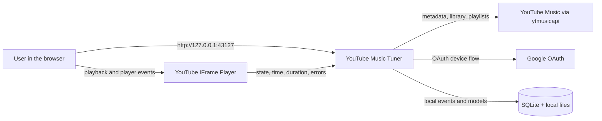
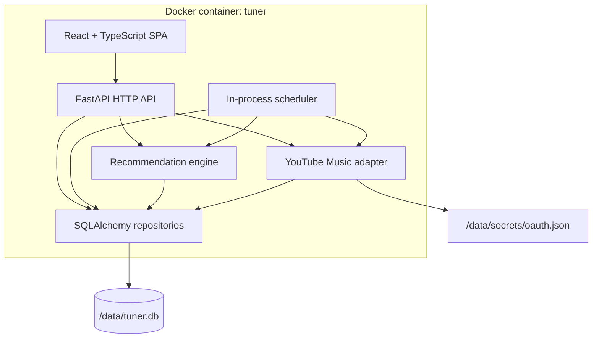
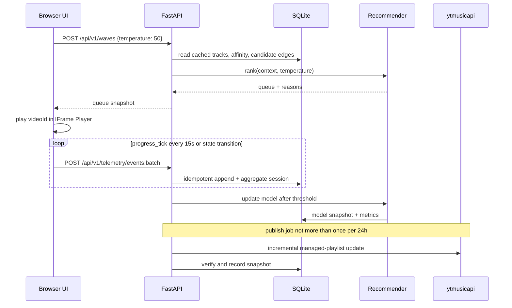

# System architecture

## 1. Architectural style

A local modular monolith with a single web process and a single SQLite database. The frontend is built separately in a multi-stage Docker build, but at runtime it is served by FastAPI from the same container. This design reduces operational complexity and eliminates Redis, a message broker and a separate model server.

Strict boundaries are kept inside the monolith: the UI, playback telemetry, the recommendation domain and the YouTube adapter must not know each other's details through shared global objects.

## 2. Context



Playback is performed by the browser through the official IFrame Player. The backend does not receive or proxy the audio stream.

## 3. Container diagram



## 4. Selected stack

### Backend

- Python 3.13 in the runtime image;
- FastAPI + Uvicorn, a single worker;
- Pydantic for external DTOs and settings;
- SQLAlchemy 2 + Alembic;
- SQLite in WAL mode;
- `ytmusicapi==1.12.1` at the start of implementation;
- NumPy for the local LinUCB/contextual-bandit computation;
- structured JSON logs via the standard `logging`.

The exact versions of all runtime dependencies are pinned by a lockfile. Updating `ytmusicapi` is a separate controlled operation.

### Frontend

- React + TypeScript + Vite;
- TanStack Query for server state;
- Zustand or a small reducer store for player/queue state;
- CSS variables + CSS Modules; without a heavy component system;
- YouTube IFrame Player API;
- Playwright for end-to-end tests.

### Runtime

- multi-stage Dockerfile: Node build stage → Python runtime stage;
- Docker Compose for the port, named volume, health check and configuration;
- bind `127.0.0.1:${APP_PORT:-43127}:43127`;
- a single named volume `tuner-data:/data`; the runtime identity is fixed as UID/GID `10001:10001`.

## 5. Backend modules

Planned structure:

```text
backend/app/
  api/              HTTP routes, DTO, error mapping
  auth/             OAuth status and bootstrap CLI
  domain/           track, playlist, telemetry and recommendation models
  integrations/
    youtube_music/  ytmusicapi adapter and parsers
  player/           session aggregation and signal classification
  recommender/      features, candidate generation, ranking, reranking
  publishing/       managed-playlist planner and state machine
  jobs/             scheduler, leases, cooldowns, retries
  persistence/      SQLAlchemy models and repositories
  settings.py
  main.py
```

Dependency rule: `api/jobs → application services → domain + repository interfaces`; the `ytmusicapi` implementation is not imported from domain/recommender.

## 6. Frontend modules

```text
frontend/src/
  app/              routing and shell
  features/
    wave/
    library/
    playlists/
    insights/
    settings/
  player/           iframe adapter, queue, telemetry accumulator
  api/              generated/typed HTTP client
  ui/               reusable presentational components
  styles/            tokens and global layout
```

`player/iframeAdapter` is the only place that knows the global `YT.Player` object. The rest of the frontend works with the `PlayerPort` interface.

## 7. Main data flow



## 8. Scheduler and concurrency

A separate job broker is not needed. A single Uvicorn worker starts a lightweight scheduler in the application's lifespan. The periodic check for due jobs reads the `jobs` table, and each job acquires a lease with `locked_until`.

This protects against repeated execution after a restart and leaves the option of moving the worker out later without changing the domain logic. Even with an erroneous configuration with two processes, the unique idempotency key and the lease will not allow one playlist to be published concurrently.

Job types:

- `library_sync`;
- `candidate_refresh` — once a day, traversal from fresh seeds;
- `graph_expand` — every 6 hours, expanding the frontier of the candidate graph;
- `affinity_rollup` — every 6 hours, recalculation of the rolling windows of the aggregates;
- `model_train`;
- `playlist_publish`;
- `retention_cleanup`;
- `database_backup`.

`graph_expand` is the only periodic job other than `candidate_refresh` that spends external calls; `affinity_rollup` is entirely local.

### Scheduler pace

The loop does not sleep after a successfully completed job — otherwise the queue would be worked through at one task per 5 seconds. Hence three rules, without which a constantly failing job turns into a tight loop:

- **any completed attempt counts as an attempt.** The next enqueueing is no sooner than `min(interval, 30 minutes)` after the previous completion, regardless of the outcome. Otherwise a failure does not shift the "last successful run", and the job is enqueued again at the very next poll;
- **an open circuit defers only external jobs.** `model_train`, `retention_cleanup`, `database_backup` and `affinity_rollup` do not call YouTube, and refusing to run them only multiplies failure records;
- **no more than 20 jobs in a row without a pause.**

The price of the error has been measured: before the fix the scheduler created 331 records per minute, the `jobs` table grew to 2.5 million rows, and the database file to 944 MB.

## 9. State and caching

- Browser state: the current queue, position, UI filters and a durable IndexedDB outbox of unconfirmed events.
- SQLite: the source of truth for the catalogue, telemetry, the model, jobs and the publish manifest.
- YouTube Music: the external source of the library and the target storage of managed playlists, but not the source of truth for local telemetry.
- In-memory cache: allowed only as a speed-up; after a restart everything is restored from SQLite.

## 10. Failure handling

| Failure | Behaviour |
| --- | --- |
| YouTube Music unavailable | The UI keeps working on cached data; the job gets backoff. |
| OAuth expired/revoked | write/sync jobs are blocked, the UI shows reconnect; local listening to the cached queue remains available if the iframe is able to load the track. |
| `ytmusicapi` parser broke | the adapter returns a typed integration error; the raw response is not logged in full; the last successful library is preserved. |
| Container restarted during publish | the state machine performs a fresh read and verification: confirms COMPLETE, saves PARTIAL with a continuation for the next 24-hour window, or marks FAILED; WRITING is not blindly retried. |
| Batch duplicated | a unique `client_event_id` turns the repeat into a no-op. |
| IFrame error | the event is neutral for taste, the track is temporarily marked playback-unavailable and the queue moves on. |
| DB corruption | startup halts with an explicit error; automatic restoration from backup without confirmation is not performed. |

## 11. Observability

- `GET /health/live` — the process responds;
- `GET /health/ready` — migrations applied, DB available;
- UI Settings shows the last successful sync/train/publish, the number of pending events and the open circuit breaker;
- logs contain `request_id`, `job_id`, `operation`, `duration_ms`, `outcome`, but not track authorisation tokens and not full external payloads;
- the `api_call_ledger` table provides a local audit of external operations.

## 12. Architectural constraints

- The backend must not receive a direct audio stream URL.
- The UI must not imitate, hide or overlap the mandatory elements of the YouTube player.
- A recommendation must not depend on the availability of an LLM or the internet after the candidate refresh.
- An ordinary publish is allowed only for an ACTIVE `managed_playlists` record with matching playlist ID, instance and remote ownership marker. CREATING/UNVERIFIED/CLEANUP_REQUIRED permit only reconciliation, verify/adopt or confirmed cleanup of the exact marker.
- External requests must not be sent from React directly, except the YouTube IFrame API; all library operations go through the backend.
