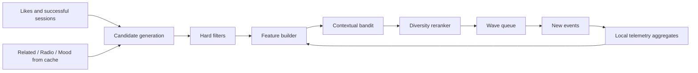

# Recommendation engine

## 1. AI decision

The primary recommender does not use an LLM — neither an external nor a local one. The task is not text generation but online ranking of candidates from a small personal feedback stream. Better suited for it are:

- the YouTube Music recommendation graph for obtaining candidates;
- local behavioural features;
- a simple contextual bandit, updated after every qualified session;
- deterministic diversity, fatigue and safety constraints.

This is cheaper, more private, more explainable and more robust on a small data volume than an LLM. Detailed decision: [ADR-002](decisions/ADR-002-local-recommender-no-llm.md).

## 2. Recommendation architecture



The system separates four operations:

1. gather a sufficiently wide candidate pool;
2. filter out what is inadmissible;
3. estimate personal usefulness and uncertainty;
4. form a sequence without repeats and fatigue.

## 3. Candidate generation

### Sources

- liked tracks — for the familiar part;
- strong successful sessions without an explicit like;
- `get_song_related(seed)`;
- radio queue from `get_watch_playlist(seed, radio=True)`;
- candidates from previously synchronised user playlists;
- mood playlists only when a context is selected;
- likes that have not been played for a long time, for rediscovery.

Opening Wave makes no external request.

### Candidate graph

The `seed → candidate` edges are YouTube's statement that two tracks are similar, that is, a collaborative signal computed over millions of listeners. For a single-user installation this is the only available source of collaborative filtering, so edges are **accumulated, not cached**: `expires_at` only means "the seed may be queried again", but the edge itself stays in the pool. Retention deletes only edges that have not been refreshed for a year (docs/07 §8).

Each edge carries `hop` — the distance from a positive root (a like or a track with a strong local reward). A candidate's contribution is discounted as `0.72^(hop-1)`, the maximum depth is 3 hops.

The multiplicity of links is not collapsed: a candidate reached from five different favourite tracks differs from a candidate with a single edge. This is co-occurrence — the very signal from which item-embedding methods learn similarity, and here it is available directly as the in-degree from positive roots.

### Seed selection

A single candidate refresh selects at most 6 seeds from positive roots (likes **and** tracks with a strong reward, not only likes):

- 2 from highly rated tracks that have not been played for a long time;
- 2 from recent successful discovery;
- 2 random ones from a stable positive cluster to preserve diversity.

A single artist cannot provide more than two seeds per run.

### Frontier expansion

Every 6 hours the `graph_expand` job expands the graph frontier: it takes up to 12 not-yet-expanded nodes and requests their radio.

**Breadth before depth.** Positive roots that have never been expanded from are expanded first, and only then the candidates with the most support. The reason is a measured failure: a support-greedy traversal deepened a single cluster, and out of 51 likes only 8 became seeds — forty-three favourite tracks were not represented in the pool at all. From the outside this feels like "the same music in every wave", even though formally no tracks repeated.

Separately: a like that no one's radio points to is absent from the support table altogether, so the frontier must be built from the union of roots and reachable nodes, not from the latter only.

Radio was chosen over related because it costs one call and returns up to 25 candidates — the best ratio of material to calls. Disliked nodes and nodes with negative decayed reward are not expanded: pulling in things similar to what is disliked is pointless. When the frontier is exhausted, the nodes that have gone longest without a refresh are re-opened.

The overall daily ceiling for discovery calls is 120 (docs/03 §9).

## 4. Hard filters

Before the ML score the following are excluded:

- explicit dislike or manual block;
- a track with a local veto ("Don't Like At All", see §11) and **all non-liked tracks of veto artists**;
- a candidate with a high slop score (see "Slop filter" below);
- an unavailable `videoId`;
- a track with repeated playback errors within 24 hours;
- a track in the recent-plays window (see below), except repeat on explicit request;
- a track in skip quarantine;
- a metadata-only entity without a playable `videoId`;
- a candidate excluded by the user from the current queue.

Explicit dislike takes priority over any score and does not expire on its own. So does veto: it is a local signal that is never synchronised to YouTube.

### Slop filter

YouTube's radio and related pull mass-generated content ("AI slop") into the graph: uniform tracks with generated covers, hashtags in the title and farm channels. A local metadata heuristic — with no external calls and no LLM (ADR-002) — awards slop points for: "AI"/"A.I."/"prompt"/"suno"/"udio" in the artist name; "type beat"; two or more hashtags in the title; background formulas ("lounge music", "for relaxation/study/sleep", "no copyright", "royalty free"); emoji; a genre tail after "|"; an extra-long title.

A score ≥ 3 excludes the candidate from the pool; exactly 2 gives a −0.6 penalty to the score. The heuristic applies to all tracks **including liked ones** — by the owner's direct decision (2026-08-09) slop is caught unambiguously, and an accidental like does not save a track from exclusion. Removing such a like in YouTube does not happen automatically: un-like is an explicit action (a one-off cleanup is performed on request); only the exclusion from results is automatic. Calibration on a live database of 8.5k tracks (2026-08-09): 28 excluded, 53 penalised; the only flagged like turned out to be an AI track and was cleaned out. The heuristic is a coarse filter; whatever slips through is finished off with the "Not my thing" button, which removes the artist entirely.

### Artist farm detection

A farm gives itself away by its behaviour: a single "artist", dozens of tracks from one template, slop markers on most of them. After each graph update (candidate refresh, graph expand) the detector looks at the artist's whole catalogue and sets an **auto-veto on the whole artist** (`source=FARM_AUTO`) when any of the following holds:

- ≥ 3 tracks with an exclusion score (the Gazzarin farm: 11 tracks with 5 points each);
- ≥ 5 tracks with slop markers (a channel with "A.I." in its name flags every upload);
- ≥ 4 tracks whose titles are one filled-in template (mean pairwise similarity of normalised titles ≥ 0.6), and at least one track with a slop marker. Template similarity **never acts on its own** — a "Symphony No. N" series by a living artist will not be affected.

A human always outranks the detector: an artist with at least one liked track is untouchable, and an auto-veto removed by the user is kept as an inert `OVERRIDDEN` record — the detector never overrides an explicit human decision. A manual veto via the button is `source=MANUAL`.

### Recent-plays window

The fixed 30 positions were sized for a pool of a couple of hundred tracks; with a growing graph such a window hides almost nothing. The window scales: 35% of the pool size, but no less than 30, no more than 400 and never more than half the pool.

The window is two-speed. For discovery the full width applies. For familiar tracks it is a short window (no more than 15 positions and no more than a third of the playable favourites): hearing a favourite track again after a week is the very point of the familiar quota, while a wide window simply empties the familiar part of the wave.

### Skip quarantine

Repeated skips take a track out of rotation: two skips — for a week, three or more — for a month. A track that has been listened to the end at least once gets one "grace" — a skip may have meant "not now". Liked tracks are never quarantined: an explicit like outweighs any number of skips.

Hard filters are responsible only for the inadmissibility of a specific track. Artist/album repetition constraints belong exclusively to the sequence-level diversity reranker from §11, so the rule is not duplicated in two layers.

## 5. Features

Each `(candidate, current_context)` pair is turned into a normalised vector `x`.

### Personal affinity

- the candidate is already liked;
- affinity for the artist and album;
- mean reward of the related seeds;
- number of independent seeds that led to the candidate;
- best/mean position in the related/radio source;
- similarity to the last 5 successful tracks by artist/album/source graph.

### Novelty and fatigue

- the candidate has never been played;
- days since last play;
- number of plays over 1/7/30 days;
- artist exposure over 1/7 days;
- whether there was an early skip recently;
- whether there was a successful rediscovery after a long break.

### Context

- selected mood/activity;
- local hour and day of week — only after an explicit opt-in;
- current temperature;
- mean reward of the last 5 sessions;
- the user changing the context during the queue.

### Data quality

- whether a duration is present;
- number of artist/track observations;
- signal source: local telemetry, explicit rating, remote history;
- confidence aggregate.

In the first stage audio embeddings, song lyrics and personal data from outside the application are not used.

## 6. Reward

Actions are first converted into a raw reward, then nonlinearly normalised into the range `(-1, 1)` without collapsing different signals.

| Signal | Raw weight |
| --- | ---: |
| explicit like | +5 |
| explicit dislike | -8 and hard block |
| replay within 10 minutes | +3 |
| natural end or ≥90% of actual playback | +2 |
| 60–90% without completion and explicit next | +1 |
| seek backward | +0.5, maximum +1 per session |
| explicit next before 20% | -3 |
| explicit next at 20–60% | -1 |
| explicit next before 30 seconds with unknown duration | -2 |
| explicit next at 30–120 seconds with unknown duration | -0.5 |
| 10–60% without explicit next | 0 |
| pause/buffer/error/page close | 0 |
| record from remote history | +0.15 to recency, not to taste reward |

The `reward-v1` formula:

1. Sum the applicable implicit weights; completion `+2` takes priority over partial-listen `+1`, so they are never summed. Partial-listen applies only when `NOT completed AND 0.60 <= played_ratio < 0.90 AND NOT explicit_next`. Replay and seek-back may be added independently, the seek-back contribution is capped at `+1`. Clamp the resulting `implicit_raw` to the reachable range `[-3, 6]`.
2. On explicit dislike set `raw=-8` regardless of implicit signals and apply a hard block.
3. On explicit like set `raw=5 + clamp(implicit_raw, 0, 2)`: a negative does not cancel the explicit rating, but completion/replay preserve an additional gradient.
4. Without an explicit rating use `raw=implicit_raw`.
5. Normalise: `reward = tanh(raw / 4)`.

Examples: completion `tanh(0.5) ≈ 0.462`, replay without completion `≈ 0.635`, early skip `≈ -0.635`, like with no other signals `≈ 0.848`, dislike `≈ -0.964`. Thus like, replay and completion do not all become the same `+1`. The formula version is stored as `reward_version`; tests pin the values with tolerance `1e-3`.

## 7. Cold start

Until enough local telemetry has accumulated, a rule-based score is used:

```text
0.35 * source_strength
+ 0.25 * seed_affinity
+ 0.20 * artist_affinity
+ 0.10 * rediscovery
+ 0.10 * novelty_by_temperature
- fatigue_penalty
- recent_skip_penalty
```

Clarifications to the input components, without which the scale drifts:

- `source_strength` is multiplied by `hop_discount(hop)` — a distant candidate is weaker than a near one. This is **not** applied to a like: a like is a graph root, not a candidate at a distance, and its appearance in someone else's radio must not devalue it;
- `seed_affinity` is built on the position in the source's results, and support from several favourite seeds is added as a multiplier `1 + 0.5 * support_score`, without replacing it. Replacing the rank with support shifted the whole scale down, and the `quality_expected >= -0.20` threshold stopped passing for almost everything;
- `fatigue_penalty` and `recent_skip_penalty` are taken with a coefficient of 0.35 for explicit likes: a like is a request to play the track more often, and skipping it usually means "not now", not "not this track". At full strength these two penalties sank most of the favourites below the publication threshold.

All input components are normalised, and the formula result is stored as `rule_score=clamp(weighted_sum, 0, 1)`. To put the playlist gate on one common scale, the monotonic transformation `quality_expected = 2 * rule_score - 1` is applied. This is a technical mapping, not a statistical calibration of the rule score to reward or LinUCB. With ACTIVE LinUCB, its exploitation component `quality_expected=clamp(theta^T x, -1, 1)` is used, without the exploration bonus. Thus initial create, manual publish and baseline/SHADOW pass through the gate `quality_expected >= -0.20`; before ACTIVE this is literally equivalent to `rule_score >= 0.40`, and there is no special gate bypass. Comparing comparative means across different policies is forbidden. The generation stores `quality_score_source=RULE_MAPPED|LINUCB_EXPECTED`.

Shadow training of the contextual bandit is enabled when all of the following have accumulated simultaneously:

- at least 40 qualified playback sessions;
- at least 20 distinct tracks;
- at least 12 positive sessions;
- at least 8 negative/explicitly skipped sessions.

The first 100 qualified sessions are always chosen by the frozen `rule-score-v1`, so that the baseline stays clean. When the four thresholds above are reached, LinUCB builds the first snapshot on all available feature/session pairs and is then updated in SHADOW status: it computes an alternative ordering and metrics but does not influence the queue.

Until all four thresholds are met, the UI shows separate progress, for example `40 sessions · 6/8 negative signals`. After they are met — `Baseline N/100 · model in shadow`. Only after the 100th session and passing the model safety gates does the snapshot become ACTIVE; if the label-balance thresholds or gates are not passed, the rule-based ranker remains the serving policy, and the new snapshot stays REJECTED/SHADOW until the next check.

## 8. Contextual bandit

The first implementation is a shared linear UCB (LinUCB) on NumPy. For feature vector `x`:

```text
theta = inverse(A) * b
expected = thetaᵀx
uncertainty = sqrt(xᵀ inverse(A) x)
ucb_score = expected + alpha(temperature) * uncertainty
```

After a qualified session:

```text
A := A + x*xᵀ
b := b + reward*x
```

The matrix has L2 regularization and a small fixed number of features, so the local computation takes milliseconds. A snapshot stores `A`, `b`, feature schema version, training watermark and offline metrics.

Why not a neural network: a single user's data is scarce, the objective function changes, while LinUCB provides a built-in uncertainty estimate and understandable control of exploration.

## 9. Temperature

Temperature 0–100 does not merely change randomness: it controls the familiar share, the exploration bonus and the permitted distance from the seed.

| Range | Familiar quota | Discovery quota | Exploration `alpha` | Behaviour |
| --- | ---: | ---: | ---: | --- |
| 0–25 | 80% | 20% | 0.10–0.25 | likes, proven artists, rediscovery |
| 26–60 | 55% | 45% | 0.25–0.60 | balance of familiar and new |
| 61–85 | 30% | 70% | 0.60–1.00 | new artists and less obvious edges |
| 86–100 | 15% | 85% | 1.00–1.30 | broad exploration with a quality floor |

After the UCB score, softmax sampling is applied; its mathematical temperature also grows, but hard filters and the minimum quality floor remain. The effect of the control must be noticeable already within the first ten tracks.

Quotas are a target, not a reason to violate hard filters. If the familiar bucket cannot fill its quota because of the novelty window, quarantine or blocks, the missing positions go to the discovery candidates with the maximum exploitation score; the response returns the actual mix and reason code `FAMILIAR_POOL_WIDENED`. The recent-track filter is not relaxed automatically. If the total number of eligible candidates is less than the required length, a shorter queue is returned and one candidate-refresh job is scheduled with the usual cooldown.

The quota is two-sided. Scores of familiar tracks are systematically higher than those of discovery candidates, so a soft bonus is not enough: without an explicit ceiling the wave is pulled toward the known regardless of the position of the control. Exceeding familiar above the target is allowed only when admissible discovery candidates are exhausted — including those blocked by diversity constraints — and such an overflow is marked with reason code `DISCOVERY_POOL_WIDENED`. A silent excess of the familiar share is a defect.

Separately from a shortage of material, the rotation limit from §11 applies: a wave does not take more than 75% (cold) — 50% (hot) of the available familiar tracks, even when the quota asks for more. Such a shortfall is marked with the code `FAMILIAR_ROTATION_CAP` and is intentional: otherwise the next wave would have nothing to differ by.

The familiar side of the wave consists of likes, tracks with a stored strong positive signal (reward ≥ 0.4) and "warm" tracks: played at least once, with positive decayed reward (≥ 0.15) and played within the last 60 days. Warmth is a property of recent experience: a single session from half a year ago does not make a track familiar forever, because the weighted mean of one observed reward does not decay by construction. After 60 days of silence the track returns to the discovery side and becomes a rediscovery candidate.

## 10. Mood and activity

Mood is a separate axis, not a synonym of temperature. V1 offers:

- `Any`;
- `Focus`;
- `Energy`;
- `Calm`;
- `Background`;
- `Rediscover`.

Initially, mood uses candidates' membership in YouTube Music mood playlists and behavioural history specifically in that context. The user selects the context explicitly; the application does not try to guess emotions with a camera, a microphone or an LLM.

`Background` here means an unobtrusive musical character with an open, visible tab, not permission for background playback; the hidden-tab pause setting (`pause_on_hidden`, docs/04 section 1) applies in all moods.

If the pool for a mood is too small, the filter becomes a soft boost and the UI shows `context widened`; the queue is not looped.

Actual state of v1: YouTube Music mood playlists are not yet fetched, so the contexts `Focus`, `Energy`, `Calm` and `Background` have no data for the filter — they do not change the selection and always return reason code `CONTEXT_WIDENED`. `Rediscover` already works from local data: a hard filter on tracks not played for at least 60 days (`last_played_at` from track affinity); when there are fewer such tracks than the wave length, the filter degrades to a soft boost with the same code `CONTEXT_WIDENED`. A context that cannot influence the results must report this with a code instead of pretending to filter.

## 11. Diversity reranking

The bandit scores individual tracks, but music is listened to as a sequence. The final reranker chooses the next item by:

```text
final = model_score
      - same_artist_penalty
      - same_album_penalty
      - recent_track_penalty
      - source_concentration_penalty
      - wave_history_penalty
      + familiarity_quota_pressure
```

Penalties are computed over a window of the last 8 selected tracks, not over the whole prefix — this is how windowed DPP rerankers work in product feeds (window 6–12).

**Selection is stochastic.** The next track is not taken by argmax but sampled from the 12 leaders by softmax; softness grows with temperature. Without this, an unchanged pool would reproduce the same wave — the main source of the feeling "it's all the same". Sampling is seeded with the generation's `random_seed`, so the queue stays reproducible given the same database state.

**The familiar quota is a target, not a tie-breaker.** The pressure grows as slots are spent; if all the remaining slots "belong" to familiar, the choice is restricted to familiar tracks. The calibration is symmetric: once the quota is met, familiar candidates drop out of the choice as long as at least one admissible discovery candidate remains, and a forced overshoot is marked `DISCOVERY_POOL_WIDENED`. This is calibration of the feed's composition, not a hope that the scores will converge. The same ceiling protects the rotation limit: `effective_target` is both the target and the upper bound of the familiar selection.

**Rotation outranks the quota.** A wave does not take more than 75% (cold) — 50% (hot) of the available familiar tracks. Otherwise the next wave has nothing to differ by: with 18 playable favourites and a 55% quota, picking "all the familiar ones" gave 45% overlap between waves. A quota shortfall for this reason is marked with the code `FAMILIAR_ROTATION_CAP`.

**Memory of past waves.** The last 4 generations are remembered. Discovery tracks of the previous wave are excluded hard while the pool allows it, and penalised when it does not. For familiar tracks the penalty scale is an order of magnitude softer: a handful of likes cannot fill four waves without repeats, and a repeat of a favourite is not something people complain about.

**Artist-level memory.** Avoiding repeated tracks is not enough: with a large pool the ranking still converged on the same ~80 artists. Artists from recent waves get a separate penalty; likes are excluded from it. The stochastic selection window also grows with the pool size — choosing from a fixed 12 leaders among two thousand candidates converges to the same handful regardless of graph size.

**An artist's negative history penalises selection.** Previously, negative artist affinity was clipped to zero — an artist whom the listener consistently skips was indistinguishable from an unknown one. Now a non-liked candidate gets a penalty `0.6 × max(0, −decayed_reward) × min(1, plays_all/3)` from its primary artist. The confidence multiplier is mandatory: the decayed reward of a single observation does not decay by construction, and without it one accidental skip (≈ −0.635) would punish the artist forever on a single data point. One skip is a light nudge down (≈ −0.13), three confirmed bad sessions are a full wall (up to −0.6). The penalty is applied after the model score, like the other post-penalties, and does not touch the frozen rule-policy and `quality_expected`.

**Explicit strong negative — "Don't Like At All" (veto).** A local per-track button for the case "this is not my thing at all": the track itself permanently drops out of the pool, and **all non-liked tracks of its primary artist are excluded along with it** — from waves and from publications alike. The initial version was limited to a −0.8 penalty, but a penalty is not enough against mass-generated content: with a thin discovery pool the penalised track still surfaced, and the owner needed "the maximum penalty so they never appear again" (2026-08-09). The only thing that survives an artist veto is tracks with an explicit like: explicit taste matters more. Candidates reachable by edges from a veto track get −0.35; the seed weight of a veto track in the graph is zero, and graph traversal does not expand veto nodes. Pressing the button records a `veto_set` telemetry event on a real session (the equivalent of an explicit dislike for training); removing a veto deletes the row and brings the artist back, but does not rewrite session history. Veto is never synchronised to YouTube: graph edges come from positive seeds, and a YT dislike would hardly change our pool, while remaining a visible and semi-irreversible account state.

Target metric: overlap of adjacent waves ≤ 30%, discovery repeat — 0%. The actual overlap is written to `queue_generations.overlap_previous_percent` and is visible in Insights → Discovery pool.

The first positions additionally prefer tracks that have already played successfully. The reason is a YouTube limitation: whether embedding is allowed can be learned only by an actual attempt — neither `oEmbed`, nor `get_song`, nor the embed page reports it (verified 2026-08-01). An unverified track in the first position causes a silent skip that looks like a broken player. The bonus decays by the fourth position, so discovery is not penalised. The effect appears only when the history is longer than the novelty window: before that, every verified track is simultaneously recent and is excluded by the recency filter.

Default constraints:

- no more than one track of an artist within a window of 5;
- no more than two tracks of an artist within a window of 15;
- no more than three consecutive candidates from one seed/source;
- at least 25% distinct seeds in the first 20 positions;
- liked tracks do not go as a block: they are interleaved with discovery.

All artist-window rules are applied only by the reranker. If they make the queue shorter than requested while the overall candidate pool is sufficient, the constraints are relaxed deterministically: source concentration → the maximum of two artists in the window of 15 is widened to three → the one-artist window is reduced from 5 to 3. Hard filters, explicit dislikes and recent-track exclusion are never relaxed. Each relaxation is recorded with a reason code and shown as `diversity widened`.

## 12. Automatic training and publishing

### A playlist is a snapshot, not a stream

A wave optimises freshness: novelty windows, memory of past waves and the rotation limit deliberately hold back part of the material. A playlist is read at an arbitrary moment, so it needs the best available composition, not a difference from yesterday's. A generation with the "for publication" flag turns off all the freshness machinery; artist diversification remains.

### Preview is mandatory and it is real

`POST /{kind}/plan` returns **the track list itself** — title, artists, the familiar/discovery label and reason codes — not just counters. The UI shows it, allows playing it from any position through the regular player, and offers `Regenerate`.

The shown list is stored on the manifest (`proposed_desired_json`) together with the seed: a repeated request returns the same list, and `Publish` writes exactly it. Otherwise something the user had not seen would be published — whereas the line "never touched without a preview" promises exactly that this cannot happen.

`Regenerate` replaces the proposal with a new one: the seed is random, and the selection inside `_compose` samples from twenty leaders instead of cutting off the top of the list. The overlap between variants is 60–80%, depending on how narrow the pool of tracks above the quality threshold is; the order changes completely. Full independence of the variants is unattainable and undesirable: a playlist must consist of the best, and there is only a finite amount of the best.

An ACTIVE playlist can also be deleted — it is the listener's playlist, and the marker check still guarantees that Tuner will not touch anything that is not its own. The previous prohibition meant that a playlist the listener did not like could not be removed from the application at all.

### The composition is built to satisfy the gates

The list is not "the first N tracks of the wave". It is built to satisfy the checks: only tracks above `quality_expected >= -0.20`, the familiar share within a tolerance of ±10 points, no more than three tracks per artist, no adjacent tracks of the same artist and at least 40% distinct artists. The search goes from the largest permissible size downward, and the per-artist limit is relaxed 3 → 2 → 1 only when necessary.

A sixfold reserve relative to the target size is ranked, and each choice is sampled from twenty leaders rather than cut off from the top. Otherwise `Regenerate` returned almost the same sixty tracks even with two hundred suitable ones.

Cutting off the first N left all these conditions to chance: the gates rejected all three playlists, and the rejection was returned as an ordinary `200`, which made the Create button look broken. A rejection is always accompanied by a reason and is shown separately for each playlist.

The first SHADOW training happens after the bootstrap threshold of 40 sessions and the minimum data-diversity/signal-balance thresholds from §7. Subsequent SHADOW/ACTIVE updates are performed if:

- at least 15 new qualified sessions have appeared since the last snapshot;
- at least 60 minutes have passed since the previous training;
- there is no unfinished training job.

Auto-publication is allowed if:

- the clean baseline of 100 sessions is closed and there is an ACTIVE model snapshot;
- at least 15 new qualified sessions have appeared since the last publication or an explicit rating has changed;
- at least 24 hours have passed;
- the candidate pool is no older than 7 days;
- the new playlist passes the quality gates;
- `auto_publish` is enabled.

Publishing is not triggered merely by a timer in the absence of new data.

The exception is an unfinished PARTIAL publication. The new 15 sessions or rating are needed only to create a new desired plan. PARTIAL is the continuation of an already accepted immutable plan and is placed by the scheduler into the next 24-hour window even without a new listening signal. Before each fragment, OAuth/circuit, ownership marker, fresh remote hash, hard filters, explicit dislikes/blocks and both call budgets are re-checked. If a new safety signal has invalidated the desired snapshot, the continuation is cancelled and the next new plan again requires the usual trigger.

### Playlist quality gates

For each managed playlist the planner starts from `configured_target_size`, 60 by default. It chooses the largest deterministically achievable `effective_target_size <= configured_target_size` at which the temperature quota is kept within ±10 percentage points and the other gates are met. The minimum publishable size is `min_publish_size=25`. For example, for Familiar the target is 80% and the permitted minimum is 70%, so with a sufficient discovery/diversity pool 30 eligible familiar tracks allow publishing a maximum of `floor(30 / 0.70)=42` tracks instead of a perpetual refusal on the requirement of 60. As the pool grows, subsequent plans may increase the effective size within the usual incremental budget.

`Familiar` means a liked track or a track with a stored strong positive local signal — completion, replay or explicit like — under the current affinity policy. On the first sync without local history the familiar pool effectively consists of likes. Unknown remote history by itself does not make a track familiar.

A desired playlist is admitted to initial create or incremental publish only if all of the following hold simultaneously:

- exactly `effective_target_size` unique playable `videoId` values, where `25 <= effective_target_size <= configured_target_size`;
- no explicit dislikes, blocks, playback-error cooldown or metadata-only items;
- the actual familiar/discovery share deviates from the target by no more than 10 percentage points;
- the number of unique primary artists is at least `ceil(0.40 * effective_target_size)`, there are no more than three tracks of one primary artist and no adjacent tracks of the same artist;
- no candidate has `quality_expected < -0.20`; the rule-mapped score and LinUCB exploitation are compared per the definition above, the exploration bonus cannot hide a negative quality score;
- the mean `quality_expected` is not worse than the score of the current fully scorable managed playlist by more than `0.05`; the comparison is performed only within a compatible `quality_score_source`/policy version;
- discovery edges are not expired, each discovery item has at least one stored source/reason, a single seed accounts for no more than 20% of the whole list;
- the generation is reproducible from the stored serving policy/model ID, feature schema, pool watermark and random seed and yields the same desired hash.

If `effective_target_size < configured_target_size`, the result remains admissible but retains the reason `TARGET_SIZE_REDUCED_FOR_POOL` together with the configured/effective size and the available counts for familiar/discovery. If no size from configured down to 25 passes, the plan gets `INSUFFICIENT_POOL`, shows the exact `requiredFamiliar`, `availableFamiliar`, `requiredDiscovery`, `availableDiscovery`, `minimumPublishSize` and suggests reducing the target/temperature or accumulating more likes and listens. Until the pool watermark or settings change, the same failed plan is not recomputed and YouTube is not called.

The result of each gate is stored with `quality_gate_version=playlist-gates-v2`. Any other failure yields `SKIPPED_QUALITY`, shows the exact reasons in the preview and does not call YouTube. If the current remote playlist cannot be scored correctly, the comparative mean gate is skipped with reason `NO_COMPARABLE_REMOTE_SCORE`; on a change of rule/ACTIVE score policy — with `INCOMPATIBLE_SCORE_POLICY`. The other gates are mandatory.

## 13. Quality evaluation

### Online

- early skip rate by temperature/mood;
- completion rate;
- replay and explicit like rate;
- novelty: share of never-played and new-artist;
- diversity: unique artists per 20 tracks;
- regret proxy: early skips on high-score candidates;
- exposure coverage, so that the model does not get stuck in one cluster.

### Offline replay

A new model is first run on time-ordered historical sessions. Pairwise ordering and expected reward are compared with the current snapshot. Offline replay is not absolute proof, because it does not observe the reaction to unselected tracks; it serves as a regression guard.

### Safety gates

A snapshot is not activated if:

- it contains NaN/inf;
- the feature schema does not match;
- the offline mean reward is worse than the current serving policy by more than `0.03`;
- the top-50 consists of one artist by more than 40%;
- there are explicit dislikes in the top.

## 14. Possible future development

A small local embedding model may be added later for title/artist/album/mood similarity and explanations. It must work offline and must not be required for startup.

An LLM is allowed only as an optional tool:

- suggest a mood name to the person;
- briefly summarise the reasons for a change in taste from already computed numbers;
- map the user's free text such as "calm but not sleepy" onto fixed contexts.

The LLM does not receive OAuth, raw events or the full history and does not decide which track to play next. Analysis of the audio itself (CLAP/MERT and the like) is not planned until there is a separate legitimate source of local audio features.
