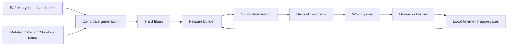

# Рекомендательный движок

## 1. Решение по AI

Основной рекомендатель не использует LLM — ни внешнюю, ни локальную. Задача состоит не в генерации текста, а в online-ranking кандидатов по небольшому персональному потоку обратной связи. Для неё лучше подходят:

- рекомендательный граф YouTube Music для получения кандидатов;
- локальные поведенческие признаки;
- простой contextual bandit, обновляемый после каждой квалифицированной сессии;
- детерминированные ограничения разнообразия, усталости и безопасности.

Это дешевле, приватнее, объяснимее и устойчивее на малом объёме данных, чем LLM. Подробное решение: [ADR-002](decisions/ADR-002-local-recommender-no-llm.md).

## 2. Архитектура рекомендации



Система разделяет четыре операции:

1. собрать достаточно широкий candidate pool;
2. отфильтровать недопустимое;
3. оценить персональную полезность и неопределённость;
4. сформировать последовательность без повторов и усталости.

## 3. Candidate generation

### Источники

- лайкнутые треки — для знакомой части;
- сильные успешные сессии без explicit like;
- `get_song_related(seed)`;
- radio queue из `get_watch_playlist(seed, radio=True)`;
- кандидаты из ранее синхронизированных пользовательских плейлистов;
- mood playlists только при выбранном контексте;
- давно не звучавшие лайки для rediscovery.

Открытие Wave не вызывает внешний запрос.

### Граф кандидатов

Рёбра `seed → candidate` — это утверждение YouTube о похожести двух треков, то есть коллаборативный сигнал, посчитанный по миллионам слушателей. Для установки на одного пользователя это единственный доступный источник collaborative filtering, поэтому рёбра **накапливаются, а не кэшируются**: `expires_at` означает лишь «seed можно опросить заново», но само ребро остаётся в пуле. Retention удаляет только рёбра, не обновлявшиеся год (docs/07 §8).

Каждое ребро несёт `hop` — расстояние от positive root (лайк либо трек с сильной локальной наградой). Вклад кандидата дисконтируется как `0.72^(hop-1)`, максимальная глубина — 3 хопа.

Кратность связей не схлопывается: кандидат, к которому ведут пять разных любимых треков, отличается от кандидата с одним ребром. Это co-occurrence — тот самый сигнал, из которого item-embedding методы учат похожесть, и у нас он доступен напрямую как in-degree от positive roots.

### Выбор seed

За один candidate refresh выбираются максимум 6 seed из positive roots (лайки **и** треки с сильной наградой, не только лайки):

- 2 из высоко оценённых и давно не звучавших;
- 2 из свежего успешного discovery;
- 2 случайных из устойчивого positive cluster для сохранения разнообразия.

Один артист не может дать больше двух seed за run.

### Frontier expansion

Раз в 6 часов job `graph_expand` расширяет границу графа: берёт до 8 ещё не раскрытых узлов с наибольшей поддержкой от positive roots и запрашивает их radio. Это ограниченный по бюджету обход в ширину — приоритет отдаётся тому, что ближе к любимому, а не случайному углу графа.

Radio выбран вместо related потому, что стоит один вызов и отдаёт до 25 кандидатов — лучшее отношение материала к вызову. Дизлайкнутые узлы и узлы с отрицательной decayed reward не раскрываются: тянуть похожее на нелюбимое бессмысленно. Когда граница исчерпана, переоткрываются самые давно не обновлявшиеся узлы.

Общий дневной потолок discovery-вызовов — 60 (docs/03 §9).

## 4. Hard filters

До ML-score исключаются:

- explicit dislike или ручной block;
- недоступный `videoId`;
- трек с повторяющимися playback errors в течение 24 часов;
- трек в окне недавних проигрываний (см. ниже), кроме repeat по явному запросу;
- трек в skip-карантине;
- metadata-only сущность без playable `videoId`;
- candidate, исключённый пользователем из текущей очереди.

Explicit dislike имеет приоритет над любым score и не истекает сам.

### Окно недавних проигрываний

Фиксированные 30 позиций были рассчитаны на пул в пару сотен треков; с растущим графом такое окно почти ничего не скрывает. Окно масштабируется: 35% размера пула, но не меньше 30, не больше 400 и никогда не больше половины пула.

Окно двухскоростное. Для discovery применяется полная ширина. Для знакомого — короткое окно (не более 15 позиций и не более трети играбельных фаворитов): услышать любимый трек снова через неделю и есть смысл familiar-квоты, а широкое окно просто опустошает знакомую часть волны.

### Skip-карантин

Повторные пропуски выводят трек из ротации: два пропуска — на неделю, три и более — на месяц. Трек, который хотя бы раз был дослушан до конца, получает одну «поблажку» — пропуск мог означать «не сейчас». Лайкнутые треки не карантинятся никогда: explicit like перевешивает любое число пропусков.

Hard filters отвечают только за недопустимость конкретного трека. Ограничения повторения артиста/альбома относятся исключительно к sequence-level diversity reranker из §11, поэтому правило не дублируется в двух слоях.

## 5. Признаки

Каждая пара `(candidate, current_context)` превращается в нормализованный vector `x`.

### Персональная близость

- candidate уже liked;
- affinity к артисту и альбому;
- средний reward связанных seed;
- число независимых seed, приведших к candidate;
- лучшая/средняя позиция в related/radio source;
- похожесть на последние 5 успешных треков по artist/album/source graph.

### Новизна и усталость

- candidate никогда не проигрывался;
- дни с последнего проигрывания;
- количество проигрываний за 1/7/30 дней;
- artist exposure за 1/7 дней;
- был ли ранний skip недавно;
- был ли successful rediscovery после долгого перерыва.

### Контекст

- выбранный mood/activity;
- локальный час и день недели — только после явного opt-in;
- текущая температура;
- средний reward последних 5 сессий;
- смена контекста пользователем во время очереди.

### Качество данных

- есть ли duration;
- число наблюдений артиста/трека;
- источник сигнала: local telemetry, explicit rating, remote history;
- confidence aggregate.

На первом этапе не используются аудиоэмбеддинги, тексты песен и персональные данные вне приложения.

## 6. Reward

Сначала действия переводятся в сырой reward, затем нелинейно нормализуются в диапазон `(-1, 1)` без схлопывания разных сигналов.

| Сигнал | Сырой вес |
| --- | ---: |
| explicit like | +5 |
| explicit dislike | -8 и hard block |
| replay в течение 10 минут | +3 |
| естественный end или ≥90% фактического проигрывания | +2 |
| 60–90% без completion и explicit next | +1 |
| seek backward | +0.5, максимум +1 за сессию |
| explicit next до 20% | -3 |
| explicit next на 20–60% | -1 |
| explicit next до 30 секунд при неизвестной duration | -2 |
| explicit next на 30–120 секундах при неизвестной duration | -0.5 |
| 10–60% без явного next | 0 |
| pause/buffer/error/page close | 0 |
| запись из remote history | +0.15 к recency, не к вкусовому reward |

Формула `reward-v1`:

1. Сложить применимые implicit weights; completion `+2` имеет приоритет над partial-listen `+1`, поэтому они никогда не суммируются. Partial-listen применяется только при `NOT completed AND 0.60 <= played_ratio < 0.90 AND NOT explicit_next`. Replay и seek-back могут добавляться независимо, contribution seek-back ограничен `+1`. Получившийся `implicit_raw` ограничить достижимым диапазоном `[-3, 6]`.
2. При explicit dislike установить `raw=-8` независимо от implicit signals и применить hard block.
3. При explicit like установить `raw=5 + clamp(implicit_raw, 0, 2)`: отрицательное не отменяет явную оценку, но completion/replay сохраняют дополнительный градиент.
4. Без explicit rating использовать `raw=implicit_raw`.
5. Нормализовать: `reward = tanh(raw / 4)`.

Примеры: completion `tanh(0.5) ≈ 0.462`, replay без completion `≈ 0.635`, early skip `≈ -0.635`, like без других сигналов `≈ 0.848`, dislike `≈ -0.964`. Таким образом like, replay и completion не становятся одинаковым `+1`. Версия формулы хранится как `reward_version`; тесты фиксируют значения с tolerance `1e-3`.

## 7. Cold start

До достаточного количества локальной телеметрии применяется rule-based score:

```text
0.35 * source_strength
+ 0.25 * seed_affinity
+ 0.20 * artist_affinity
+ 0.10 * rediscovery
+ 0.10 * novelty_by_temperature
- fatigue_penalty
- recent_skip_penalty
```

Все входные компоненты нормализованы, а результат формулы сохраняется как `rule_score=clamp(weighted_sum, 0, 1)`. Для общего диапазона playlist gate применяется монотонное преобразование `quality_expected = 2 * rule_score - 1`. Это технический mapping, а не статистическая калибровка rule score к reward или LinUCB. При ACTIVE LinUCB используется его exploitation component `quality_expected=clamp(theta^T x, -1, 1)` без exploration bonus. Таким образом initial create, manual publish и baseline/SHADOW проходят gate `quality_expected >= -0.20`; до ACTIVE это буквально эквивалентно `rule_score >= 0.40`, а специального обхода gate нет. Межполитиковое comparative-mean сравнение запрещено. Generation сохраняет `quality_score_source=RULE_MAPPED|LINUCB_EXPECTED`.

Shadow-обучение contextual bandit включается, когда накоплено одновременно:

- минимум 40 квалифицированных playback sessions;
- минимум 20 разных треков;
- минимум 12 положительных сессий;
- минимум 8 отрицательных/явно пропущенных сессий.

Первые 100 квалифицированных сессий всегда выбираются зафиксированным `rule-score-v1`, чтобы baseline оставался чистым. При достижении четырёх порогов выше LinUCB строит первый snapshot на всех доступных feature/session pairs и далее обновляется в статусе SHADOW: считает альтернативный порядок и метрики, но не влияет на очередь.

До выполнения всех четырёх порогов UI показывает отдельный прогресс, например `40 sessions · 6/8 negative signals`. После выполнения — `Baseline N/100 · model in shadow`. Только после 100-й сессии и прохождения model safety gates snapshot становится ACTIVE; если label-balance пороги или gates не пройдены, rule-based ranker остаётся serving policy, а новый snapshot остаётся REJECTED/SHADOW до следующей проверки.

## 8. Contextual bandit

Первая реализация — shared linear UCB (LinUCB) на NumPy. Для feature vector `x`:

```text
theta = inverse(A) * b
expected = thetaᵀx
uncertainty = sqrt(xᵀ inverse(A) x)
ucb_score = expected + alpha(temperature) * uncertainty
```

После квалифицированной сессии:

```text
A := A + x*xᵀ
b := b + reward*x
```

Матрица имеет L2 regularization и небольшое фиксированное число признаков, поэтому локальный расчёт занимает миллисекунды. Snapshot хранит `A`, `b`, feature schema version, training watermark и offline metrics.

Почему не нейросеть: данных одного пользователя мало, целевая функция меняется, а LinUCB даёт встроенную оценку неопределённости и понятное управление exploration.

## 9. Температура

Температура 0–100 не просто меняет случайность: она управляет долей знакомого, exploration bonus и допустимым расстоянием от seed.

| Диапазон | Familiar quota | Discovery quota | Exploration `alpha` | Поведение |
| --- | ---: | ---: | ---: | --- |
| 0–25 | 80% | 20% | 0.10–0.25 | лайки, проверенные артисты, rediscovery |
| 26–60 | 55% | 45% | 0.25–0.60 | баланс знакомого и нового |
| 61–85 | 30% | 70% | 0.60–1.00 | новые артисты и менее очевидные edges |
| 86–100 | 15% | 85% | 1.00–1.30 | широкое исследование с quality floor |

После UCB score применяется softmax sampling; его математическая температура также растёт, но hard filters и минимальный quality floor сохраняются. Эффект регулятора должен быть заметен уже в первых десяти треках.

Quotas являются целью, а не причиной нарушать hard filters. Если familiar bucket не может заполнить квоту из-за исключения последних 30 треков или блокировок, недостающие позиции переходят к discovery-кандидатам с максимальным exploitation score; ответ возвращает фактический mix и reason code `FAMILIAR_POOL_WIDENED`. Recent-track filter не ослабляется автоматически. Если всего eligible candidates меньше требуемой длины, возвращается более короткая очередь и ставится один candidate-refresh job с обычным cooldown.

## 10. Настроение и занятие

Mood — отдельная ось, не синоним температуры. V1 предлагает:

- `Any`;
- `Focus`;
- `Energy`;
- `Calm`;
- `Background`;
- `Rediscover`.

На старте mood использует membership кандидатов в mood playlists YouTube Music и поведенческую историю именно в этом контексте. Пользователь выбирает контекст явно; приложение не пытается угадывать эмоции камерой, микрофоном или LLM.

`Background` здесь означает ненавязчивый музыкальный характер при открытой видимой вкладке, а не разрешение background playback; policy-пауза при hidden действует во всех mood.

Если pool для mood слишком мал, фильтр становится soft boost, а UI показывает `context widened`; очередь не зацикливается.

## 11. Diversity reranking

Bandit оценивает отдельные треки, но музыка слушается последовательностью. Финальный reranker выбирает следующий элемент по:

```text
final = model_score
      - same_artist_penalty
      - same_album_penalty
      - recent_track_penalty
      - source_concentration_penalty
      - wave_history_penalty
      + familiarity_quota_pressure
```

Штрафы считаются в окне последних 8 выбранных треков, а не по всему префиксу — так работают windowed DPP-реранкеры в продуктовых лентах (окно 6–12).

**Отбор стохастический.** Следующий трек не берётся argmax'ом, а сэмплируется из 12 лидеров по softmax; мягкость растёт с температурой. Без этого неизменившийся пул воспроизводил бы одну и ту же волну — главный источник ощущения «всё то же самое». Сэмплирование засеяно `random_seed` генерации, поэтому очередь остаётся воспроизводимой при том же состоянии базы.

**Квота знакомого — цель, а не тай-брейкер.** Давление растёт по мере расходования слотов; если все оставшиеся слоты «должны» знакомому, выбор ограничивается знакомыми. Это калибровка состава ленты, а не надежда на то, что скоры сойдутся.

**Ротация важнее квоты.** Волна не берёт больше 75% (холодная) — 50% (горячая) доступных знакомых треков. Иначе следующей волне нечем отличаться: при 18 играбельных фаворитах и квоте 55% выборка «всех знакомых» давала 45% пересечения между волнами. Недобор квоты по этой причине отмечается кодом `FAMILIAR_ROTATION_CAP`.

**Память о прошлых волнах.** Помнятся 4 последние генерации. Discovery-треки предыдущей волны исключаются жёстко, пока пул это позволяет, и штрафуются, когда нет. Для знакомых шкала штрафов на порядок мягче: горстка лайков не может заполнить четыре волны без повторов, а повтор любимого — не то, на что жалуются.

Целевой показатель: пересечение соседних волн ≤ 30%, повтор discovery — 0%. Фактическое пересечение пишется в `queue_generations.overlap_previous_percent` и видно в Insights → Discovery pool.

Первые позиции дополнительно предпочитают треки, которые уже успешно проигрывались. Причина в ограничении YouTube: узнать, разрешено ли встраивание, можно только реальной попыткой — ни `oEmbed`, ни `get_song`, ни embed-страница этого не сообщают (проверено 2026-08-01). Непроверенный трек в первой позиции даёт молчаливый пропуск, который выглядит как поломка плеера. Бонус затухает к четвёртой позиции, поэтому discovery не наказывается. Эффект появляется только когда история длиннее 30 проигрываний: до этого любой проверенный трек одновременно является недавним и исключается recency-фильтром.

Ограничения по умолчанию:

- не более одного трека артиста в окне 5;
- не более двух треков артиста в окне 15;
- не более трёх подряд кандидатов от одного seed/source;
- минимум 25% разных seed в первых 20 позициях;
- liked tracks не идут блоком: они перемежаются с discovery.

Все artist-window правила применяет только reranker. Если они делают очередь короче запрошенной при достаточном общем candidate pool, ограничения ослабляются детерминированно: source concentration → максимум два артиста в окне 15 расширяется до трёх → окно одного артиста сокращается с 5 до 3. Hard filters, explicit dislikes и recent-track exclusion никогда не ослабляются. Каждое ослабление записывается reason code и показывается как `diversity widened`.

## 12. Автоматическое обучение и публикация

### Плейлист — это снимок, а не поток

Волна оптимизирует свежесть: окна новизны, память о прошлых волнах и ограничение ротации намеренно придерживают часть материала. Плейлист читают в произвольный момент, поэтому ему нужен лучший доступный состав, а не отличие от вчерашнего. Генерация с флагом «для публикации» отключает всю механику свежести; диверсификация по артистам остаётся.

### Состав собирается под гейты

Список не «первые N треков волны». Он строится так, чтобы удовлетворить проверки: только треки выше `quality_expected >= -0.20`, доля знакомого в пределах допуска ±10 пунктов, не более трёх треков на артиста, отсутствие соседних треков одного артиста и не менее 40% разных артистов. Перебор идёт от наибольшего допустимого размера вниз, а лимит на артиста ослабляется 3 → 2 → 1 только по необходимости.

Срез первых N оставлял все эти условия на волю случая: гейты отклоняли все три плейлиста, а отказ возвращался обычным `200`, из-за чего кнопка Create выглядела неработающей. Отказ всегда сопровождается причиной и показывается по каждому плейлисту отдельно.

Первое SHADOW-обучение — после bootstrap-порога 40 сессий и минимальных порогов разнообразия данных/баланса сигналов из §7. Следующие SHADOW/ACTIVE обновления выполняются, если:

- появилось минимум 15 новых квалифицированных сессий после последнего snapshot;
- прошло минимум 60 минут после предыдущего обучения;
- нет незавершённого training job.

Автопубликация разрешена, если:

- чистый baseline из 100 сессий закрыт и есть ACTIVE model snapshot;
- после последней публикации появилось минимум 15 новых квалифицированных сессий или изменился явный rating;
- прошло минимум 24 часа;
- candidate pool не старше 7 дней;
- новый playlist проходит quality gates;
- включён `auto_publish`.

Публикация не запускается просто по таймеру при отсутствии новых данных.

Исключение — незавершённая публикация PARTIAL. Новые 15 сессий или rating нужны только для создания нового desired plan. PARTIAL является продолжением уже принятого immutable plan и ставится scheduler на следующее 24-часовое окно даже без нового listening signal. Перед каждым фрагментом повторно проверяются OAuth/circuit, ownership marker, fresh remote hash, hard filters, явные dislikes/blocks и оба call budget. Если новый safety-сигнал инвалидировал desired snapshot, продолжение отменяется и следующий новый plan снова требует обычного trigger.

### Playlist quality gates

Для каждого managed playlist planner начинает с `configured_target_size`, по умолчанию 60. Он выбирает наибольший детерминированно достижимый `effective_target_size <= configured_target_size`, при котором temperature quota выдерживается в пределах ±10 процентных пунктов и выполняются остальные gates. Минимальный публикуемый размер — `min_publish_size=25`. Например, для Familiar цель 80%, допустимый минимум 70%, поэтому при достаточном discovery/diversity pool 30 eligible familiar tracks позволяют опубликовать максимум `floor(30 / 0.70)=42` трека вместо вечного отказа на требовании 60. По мере роста pool следующие планы могут увеличивать effective size в пределах обычного incremental budget.

`Familiar` означает liked track либо трек с сохранённым сильным положительным локальным сигналом — completion, replay или explicit like — по текущей affinity policy. На первом sync без локальной истории familiar pool фактически состоит из лайков. Неизвестная remote history сама по себе familiar-треком не делает.

Desired playlist допускается к initial create или incremental publish, только если одновременно выполнено:

- ровно `effective_target_size` уникальных playable `videoId`, где `25 <= effective_target_size <= configured_target_size`;
- нет explicit dislikes, blocks, playback-error cooldown или metadata-only items;
- фактическая familiar/discovery доля отклоняется от цели не более чем на 10 процентных пунктов;
- число уникальных primary artists не меньше `ceil(0.40 * effective_target_size)`, не более трёх треков одного primary artist и нет соседних треков одного артиста;
- ни один кандидат не имеет `quality_expected < -0.20`; rule-mapped score и LinUCB exploitation сравниваются по определению выше, exploration bonus не может скрыть отрицательный quality score;
- mean `quality_expected` не хуже score текущего полностью оцениваемого managed playlist более чем на `0.05`; сравнение выполняется только внутри совместимой `quality_score_source`/policy version;
- discovery edges не просрочены, каждый discovery item имеет минимум один сохранённый source/reason, один seed даёт не более 20% всего списка;
- generation воспроизводится из сохранённых serving policy/model ID, feature schema, pool watermark и random seed и даёт тот же desired hash.

Если `effective_target_size < configured_target_size`, результат остаётся допустимым, но сохраняет reason `TARGET_SIZE_REDUCED_FOR_POOL` вместе с configured/effective size и available counts по familiar/discovery. Если ни один размер от configured до 25 не проходит, plan получает `INSUFFICIENT_POOL`, показывает exact `requiredFamiliar`, `availableFamiliar`, `requiredDiscovery`, `availableDiscovery`, `minimumPublishSize` и предлагает уменьшить target/temperature либо накопить больше лайков и прослушиваний. До изменения pool watermark или settings тот же failed plan не пересчитывается и YouTube не вызывается.

Результат каждого gate сохраняется с `quality_gate_version=playlist-gates-v2`. Любой иной failure даёт `SKIPPED_QUALITY`, показывает точные причины в preview и не вызывает YouTube. Если текущий remote playlist нельзя корректно оценить, comparative mean gate пропускается с reason `NO_COMPARABLE_REMOTE_SCORE`; при смене rule/ACTIVE score policy — с `INCOMPATIBLE_SCORE_POLICY`. Остальные gates обязательны.

## 13. Оценка качества

### Online

- early skip rate по temperature/mood;
- completion rate;
- replay и explicit like rate;
- novelty: доля never-played и new-artist;
- diversity: unique artists на 20 треков;
- regret proxy: ранние skip у high-score candidates;
- exposure coverage, чтобы модель не застревала в одном cluster.

### Offline replay

Новая модель сначала прогоняется на временно упорядоченных исторических сессиях. Сравниваются pairwise ordering и expected reward с текущим snapshot. Offline replay не является абсолютным доказательством, потому что не наблюдает реакцию на невыбранные треки; он служит regression guard.

### Safety gates

Snapshot не активируется, если:

- содержит NaN/inf;
- feature schema не совпадает;
- offline mean reward хуже текущей serving policy больше чем на `0.03`;
- top-50 более чем на 40% состоит из одного артиста;
- в top есть explicit dislikes.

## 14. Возможное развитие

Маленькая локальная embedding-модель может быть добавлена позже для title/artist/album/mood similarity и объяснений. Она должна работать offline и не быть обязательной для запуска.

LLM допустима только как опциональный инструмент:

- предложить человеку название mood;
- кратко суммировать причины изменения вкуса по уже рассчитанным числам;
- разметить свободный текст пользователя вроде «спокойное, но не сонное» в фиксированные контексты.

LLM не получает OAuth, сырые события или полную историю и не решает, какой трек играть следующим. Анализ самого аудио (CLAP/MERT и подобное) не планируется, пока нет отдельного законного источника локальных audio features.
